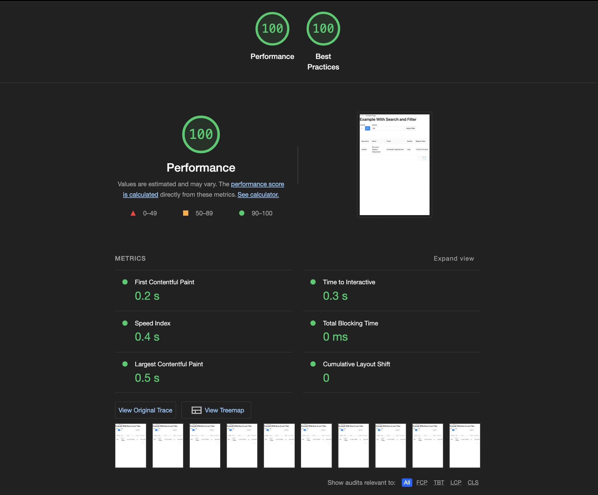

<div align="center">
<a href="https://ajaib.co.id">

</a>
<div>

<br />

---

<br />

# AJAIB INTERVIEW TEST PROJECT (Senior Web Engineer)

</div>
<div align="left">
  <p>
  This is, Ajaib Interview test for role (Senior Web Engineer) - By Nando
  </p>
  <p>
  See hosted project : <a href="https://xxidbr9.github.io/ajaib-interview-test/">https://xxidbr9.github.io/ajaib-interview-test</a>
  </p>
</div>

<div align="left">

## Project Purpose

This is a project example of an user list that from [API](https://randomuser.me/documentation) store with state management, and meet all the functionality requirements.

## Goals

- [x] Debounce search
- [x] Sort Functionality (click sort in every table column),
- [x] Reset Filter Functionality
- [x] Using state management

## Tools

- React v18
- Typescript
- Ant Design (Base on the example UI)
- Webpack v5
  - Brotli for compression,
- Babel
- Redux
  - Redux saga
  - Redux Toolkit
- Husky
- Eslint
- Jest
- Commitlint
- React Testing Library
- Axios
- [More](./package.json) 

## HOW TO RUN

#### Install all dependency
```bash
yarn
```
#### Run in Development mode
```bash
yarn dev
```

#### Build the Project
```bash
yarn build
```

#### Serve the project in Production (using serve)
```bash
yarn build
```

#### TODO :Serve the project in Production (using Docker)
```bash
docker-compose up
```

## Technical Answer

Find the Answered Question in [Google Docs](https://docs.google.com/document/d/1l05DPZr9z-DVmfXf-jOt2Zm6FIKgWty12Y09WIlJC8k/edit?usp=sharing)

```
https://docs.google.com/document/d/1l05DPZr9z-DVmfXf-jOt2Zm6FIKgWty12Y09WIlJC8k/edit?usp=sharing
```

## PRESENTATION
Take a look at the presentation [Google Slide](https://docs.google.com/presentation/d/1G5OyXL8jqz9vICtrEvgqtUGy3q0caUJwMvVnWPKcQXs/edit?usp=sharing)
## BONUS

- This project use Webpack v5, it will be easily expose and consume a module federation for Micro-frontend
- Brotli for compression, can reduce 60% bundle size when serve it to user, use with [ngx_brotli](https://github.com/google/ngx_brotli) and serve in NGINX, reduce 60% assets size
- Github action for CICD
- Great Web performance (base on lighthouse)
  

## TODO

- [ ] Build the project using docker and inside NGINX
- [ ] Test all file
